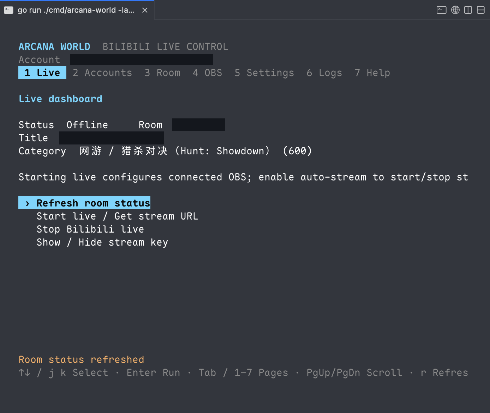
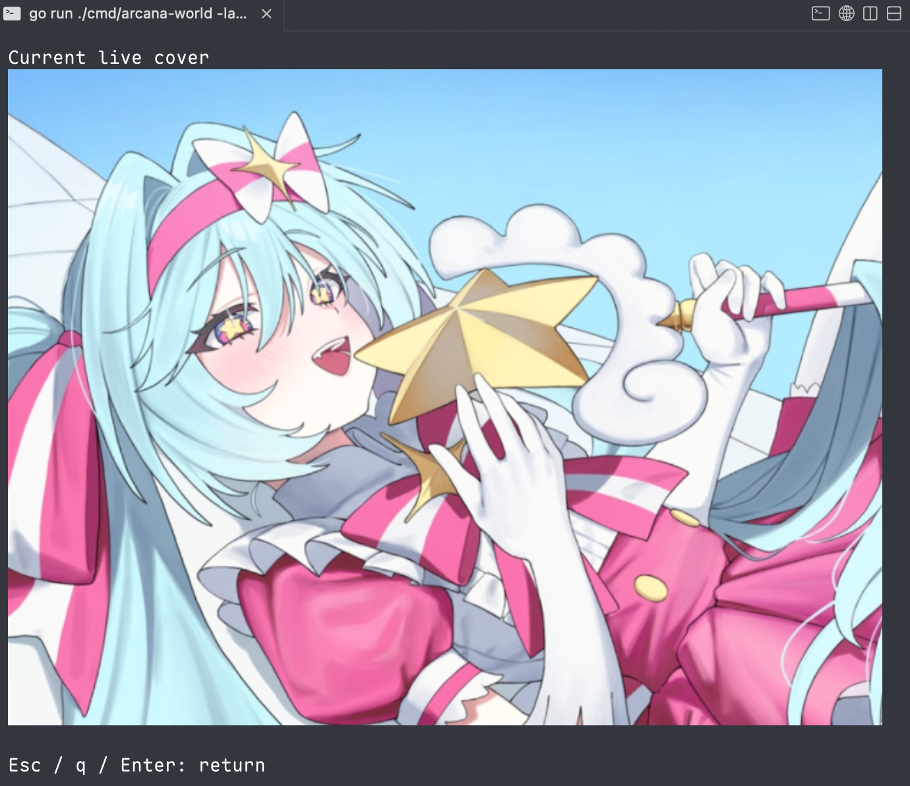

# Arcana World

<p align="center">
  
</p>

[](https://github.com/TarocchiLive/arcana-world/actions/workflows/ci.yml)
[](https://go.dev/)
[](LICENSE)
[](https://github.com/TarocchiLive/arcana-world/releases/latest)

[中文](README.md) · **English**

Arcana World is a Go-based TUI alternative to bilibili LiveHime. It is useful when LiveHime cannot run directly, such as on Linux, or when the official client does not work for you. Sign in and configure the broadcast in the terminal, then stream with OBS.

## Preview




## Feature details

- Scan a QR code to sign in, then save and switch between accounts.
- Start or stop broadcasts and edit the title, category, announcement, and cover.
- Automatically crop covers and preview them in the terminal before upload. A compatible terminal emulator is required; kitty or ghostty is recommended.
- Send stream settings to OBS and optionally start or stop streaming with the broadcast.
- Automatically listen to your room after sign-in.
- Support RTMP / SRT, Chinese and English interfaces, and proxies.
- Runs on macOS, Windows, and Linux.

## Install

Download the [latest release](https://github.com/TarocchiLive/arcana-world/releases/latest) for your platform, extract the entire archive, and run `arcana-world` at its root (`arcana-world.exe` on Windows):

| Platform | x64 | ARM64 |
| --- | --- | --- |
| macOS | [Intel](https://github.com/TarocchiLive/arcana-world/releases/latest/download/arcana-world-darwin-amd64.tar.gz) | [Apple Silicon](https://github.com/TarocchiLive/arcana-world/releases/latest/download/arcana-world-darwin-arm64.tar.gz) |
| Windows | [Download](https://github.com/TarocchiLive/arcana-world/releases/latest/download/arcana-world-windows-amd64.zip) | [Download](https://github.com/TarocchiLive/arcana-world/releases/latest/download/arcana-world-windows-arm64.zip) |
| Linux | [Download](https://github.com/TarocchiLive/arcana-world/releases/latest/download/arcana-world-linux-amd64.tar.gz) | [Download](https://github.com/TarocchiLive/arcana-world/releases/latest/download/arcana-world-linux-arm64.tar.gz) |

The download includes the main program and native overlay. Extract the entire archive and keep the `libexec` directory alongside the main executable. Move the whole folder when relocating the application. Start only `arcana-world`, then enable Native overlay in Settings; you do not need to run the overlay separately.

Building from source requires Go 1.26+ and the platform's [overlay build dependencies](cmd/arcana-overlay/README.en.md#build-and-launch). On Linux, the bundled audio helper also requires ALSA development libraries and `pkg-config` (`libasound2-dev pkg-config` on Debian/Ubuntu):

```sh
git clone https://github.com/TarocchiLive/arcana-world.git
cd arcana-world
make desktop
./bin/arcana-world
```

Run `bin/arcana-world` (`bin/arcana-world.exe` on Windows) and keep the `bin/libexec` directory. For terminal-only use, build with `make build`; graphics development libraries are not required. See [Arcana Overlay](cmd/arcana-overlay/README.en.md#supported-platforms) for overlay platform support.

## Go live

1. Open **Accounts** and scan the QR code with the Bilibili app.
2. Set your title, category, and cover on the **Room** page.
3. In OBS Studio's top menu, choose **Tools → WebSocket Server Settings → Enable WebSocket server** (check it) **→ Show Connect Info →** copy the server password **→ OK** ([official setup guide](https://obsproject.com/kb/remote-control-guide)).
OBS 28 and later include this feature, so no plugin is needed. For older versions, install an [obs-websocket 5.x plugin](https://github.com/obsproject/obs-websocket/releases) compatible with your OBS version.
4. On Arcana World's **OBS** (`5`) page, enter the server address (for example `ws://127.0.0.1:4455`) and the password you just copied.
5. Connect on the same page and enable **Auto-stream**. Adjust proxy and streaming protocol options on **Settings** (`6`).
6. Return to **Live** and start your broadcast.

By default, exiting stops OBS streaming and closes the current account's Bilibili room, including broadcasts started from another client. On **Settings** (`6`), **Stop OBS streaming on exit** and **Close live room on exit** can be disabled independently. With both off, exiting performs neither action. These settings do not affect **Stop Bilibili live** on the Live page.

If Bilibili requests identity verification, complete it and try again.

### Keyboard shortcuts

| Key | Action |
| --- | --- |
| `↑↓` / `j k` | Select |
| `Enter` | Confirm |
| `Tab` / `1–8` | Switch pages |
| `PgUp` / `PgDn` | Scroll |
| `r` | Refresh |
| `Esc` | Back or cancel |
| `q` | Quit |

Page order: `1` Live, `2` Chat, `3` Accounts, `4` Room, `5` OBS, `6` Settings, `7` Logs, `8` Help.

### Chat and history

Press `2` to browse chat and history; listening continues on other pages.

- `s`: toggle listening; `Space`: pause display / follow latest.
- `[` / `]`: page history; `End`: return to latest; `o`: switch history rooms.
- `f`: toggle optional allowlisted events; `r`: refresh / retry; `PgUp` / `PgDn`: scroll.

See the [chat display allowlist](docs/danmaku-whitelist.md) for the default message types. Unlisted messages stay hidden even with `f` enabled, but their original data is still saved.

History is stored per room in `danmaku/history.db` under the data directory; history and operation logs are retained for seven days and cleaned automatically. Messages missed while disconnected are not fetched later to fill in the database.

### Options

The interface uses your system language by default. You can choose a language or data directory with:

```sh
arcana-world --lang en                  # Use English
arcana-world --lang zh-CN               # Use Chinese
arcana-world --config-dir /path/to/data # Set the data directory
arcana-world --help                     # Show help
```

Default data directory: `~/.arcana/world`.

### Desktop overlay

Provides a focus-free, click-through, semi-transparent desktop text overlay.

See [Arcana Overlay](cmd/arcana-overlay/README.en.md) for details.

## TODO
- [ ] Fetch direct Bilibili stream URLs, connect to OBS, and start broadcasts automatically.
- [x] Receive Bilibili live chat messages and browse gifts and chat history in the TUI.
- [x] Add a Bilibili live chat overlay.
- [ ] Add LiveHime support, TTS chat readouts, and gift announcements.

## Development

```sh
make run    # Run locally
make check  # Run tests and static checks
make build  # Build
```

Translations live in [`internal/i18n/locales`](internal/i18n/locales), grouped by language and module. Report problems through [Issues](https://github.com/TarocchiLive/arcana-world/issues), or contribute a Pull Request.

## Statement

This project is an independently developed open-source tool. Follow applicable laws, regulations, and platform rules. Use it only to learn about and exchange knowledge on Go and related frameworks.

## License

Licensed under [GPL-3.0-only](LICENSE).

## Acknowledgments

- Everyone in the community who generously shared explanations and implementation references.
- [Radekyspec/StartLive](https://github.com/Radekyspec/StartLive): the source of this project's streaming protocol implementation.
- [Bubble Tea](https://github.com/charmbracelet/bubbletea): the terminal UI framework.
