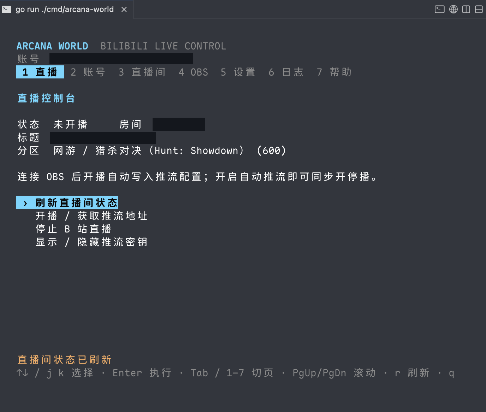
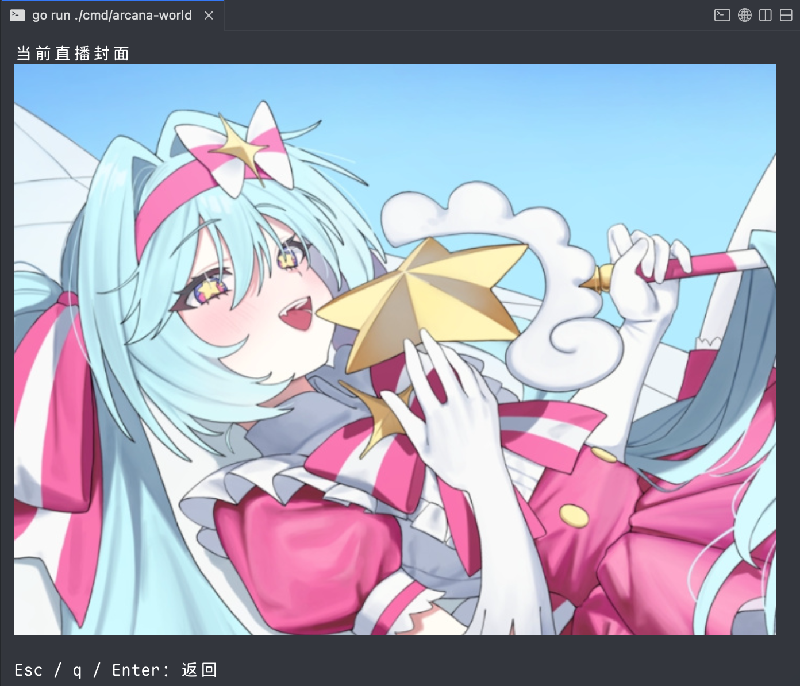

# Arcana World

<p align="center">
  
</p>


[](https://github.com/TarocchiLive/arcana-world/actions/workflows/ci.yml)
[](https://go.dev/)
[](LICENSE)
[](https://github.com/TarocchiLive/arcana-world/releases/latest)

**中文** · [English](README.en.md)

Arcana World 是基于 Go 的 bilibili 直播姬 TUI 替代。方便用于无法直接运行直播姬的平台（如Linux），或在使用官方直播姬遇到障碍时开播，用户可在终端轻松完成登录和直播设置，直接使用 OBS 推流开播。

## 预览




## 功能详情

- 扫码登录，保存和切换多个账号。
- 开播、停播，修改标题、分区、公告和封面。
- 自动裁剪封面，支持终端图片预览（需要终端模拟器支持，建议使用 kitty 或 ghostty ）后再上传。
- 将推流配置写入 OBS，按需同步开停播。
- 登录后自动监听自己的直播间，显示弹幕、礼物、醒目留言（SC）和大航海事件；支持开关及本地历史浏览。
- 支持 RTMP / SRT、中英文界面和网络代理。
- 跨平台支持：macOS、Windows 和 Linux 均可使用。

## 安装

从 [最新版本](https://github.com/TarocchiLive/arcana-world/releases/latest) 下载，解压后运行：

| 平台 | x64 | ARM64 |
| --- | --- | --- |
| macOS | [Intel](https://github.com/TarocchiLive/arcana-world/releases/latest/download/arcana-world-darwin-amd64.tar.gz) | [Apple Silicon](https://github.com/TarocchiLive/arcana-world/releases/latest/download/arcana-world-darwin-arm64.tar.gz) |
| Windows | [下载](https://github.com/TarocchiLive/arcana-world/releases/latest/download/arcana-world-windows-amd64.zip) | [下载](https://github.com/TarocchiLive/arcana-world/releases/latest/download/arcana-world-windows-arm64.zip) |
| Linux | [下载](https://github.com/TarocchiLive/arcana-world/releases/latest/download/arcana-world-linux-amd64.tar.gz) | [下载](https://github.com/TarocchiLive/arcana-world/releases/latest/download/arcana-world-linux-arm64.tar.gz) |

也可以使用 Go 1.26+ 从源码构建：

```sh
git clone https://github.com/TarocchiLive/arcana-world.git
cd arcana-world
make build
./bin/arcana-world
```

账号凭据使用系统密钥环保存。Linux 用户需要可用且已解锁的 Secret Service。

## 开始直播

1. 在「账号」页用哔哩哔哩 App 扫码登录。
2. 在「直播间」页设置标题、分区和封面。
3. 在 OBS Studio 顶栏点击「工具」→「WebSocket 服务器设置」→ 勾选「开启 WebSocket 服务器」→「显示连接信息」→ 复制服务器密码 →「确定」（[官方设置指南](https://obsproject.com/kb/remote-control-guide)）。
   OBS 28 及以上已内置此功能，无需安装插件；旧版请安装与 OBS 版本兼容的 [obs-websocket 5.x 插件](https://github.com/obsproject/obs-websocket/releases)。
4. 在 Arcana World 的「OBS」（`5`）页填写服务器地址（例如 `ws://127.0.0.1:4455`）和刚才复制的密码。
5. 在同一页连接，开启「自动推流」；代理和推流协议在「设置」（`6`）页调整。
6. 回到「直播」页，选择开播。

结束时选择「停播」。如果没有开启自动推流，需要手动在 OBS 中开始和停止推流。

如果 B 站要求身份验证，按提示完成后重新开播。

### 快捷键

| 按键 | 操作 |
| --- | --- |
| `↑↓` / `j k` | 选择 |
| `Enter` | 确认 |
| `Tab` / `1–8` | 切换页面 |
| `PgUp` / `PgDn` | 滚动 |
| `r` | 刷新 |
| `Esc` | 返回或取消 |
| `q` | 退出 |

页面顺序：`1` 直播、`2` 弹幕、`3` 账号、`4` 直播间、`5` OBS、`6` 设置、`7` 日志、`8` 帮助。

### 弹幕与历史

登录或恢复已保存账号后，默认自动连接该账号的直播间；无需复制 Cookie、输入身份码或连接 OBS。按 `2` 打开「弹幕」页，切换其他页面不影响监听。

| 按键 | 操作 |
| --- | --- |
| `s` / `Enter` | 开关监听；关闭前确认，设置跨重启保存，已有历史不删除 |
| `Space` | 暂停显示 / 跟随最新；仅暂停显示时，后台监听和保存继续 |
| `[` / `]` | 更早 / 更新的历史页，每页最多 100 条记录 |
| `End` | 回到当前监听房间的最新记录 |
| `o` | 切换有本地历史的房间，无需登录即可浏览 |
| `f` | 显示 / 隐藏其他事件 |
| `r` | 刷新历史，故障时重试；不会主动断开健康连接 |
| `PgUp` / `PgDn` | 滚动，不暂停新消息刷新；需要停留阅读时按 `Space` |

历史保存在数据目录的 `danmaku/history.db`，按直播间隔离。弹幕历史（含聊天、礼物和原始业务事件）与操作日志仅保留最近七天，启动时和运行期间会自动清理过期记录；关闭监听不影响清理。消息先通过同步数据库事务保存，再刷新界面；保留期内有可靠事件标识的消息跨重启去重，没有可靠标识的相同内容仍保留，避免误删真实重复弹幕。支持旧版及 protobuf 礼物消息；未知或格式异常的业务消息保留原始数据。超长文本仅截短显示，完整内容在保留期内仍可从本机历史读取。

支持互动类型 1–5（入场、关注、分享、特别关注、互关），以及礼物、SC、房管、禁言、红包、天选、PK、榜单、连麦和活动消息。JSON 与新版 protobuf 礼物、互动、高能榜均有实际解码；也支持开放平台事件格式，但当前监听连接仍使用网页端协议。按 `f` 显示其他事件的中文标题与结构化字段，已知枚举同时显示含义，未知值保留原值，不猜测金额或重复计入礼物连击汇总。

旧历史中的未解析普通事件会按新规则读取，保留原时间和分页位置。只有命令名而没有字段定义的条目、未来互动类型及格式异常仍标记为未解析，原始业务数据继续保留；开源项目的命令名清单不等于完整解析实现。

清理按本机接收 / 写入时间计算，运行期间每 15 分钟执行一次。无法解析时间戳的旧日志行会保留；数据库释放的页面由后续写入复用，文件不一定立即缩小。

**可靠性边界：** 网页端不是保证投递的开放 API，没有可靠的离线重放游标。断网、关停应用、关闭监听、平台风控或服务端未下发时，可能缺失消息；不能承诺零丢失或用于完整财务对账。连接边界会写入历史。磁盘写入失败时会显示警告、保留当前消息并重试；切换账号前先处理待保存消息。退出时仍无法写入会报告错误，强制终止、断电及损坏的存储仍可能丢失未提交消息。

### 常用选项

界面默认跟随系统语言，也可以手动选择：

```sh
arcana-world --lang zh-CN               # 使用中文
arcana-world --lang en                  # 使用英文
arcana-world --config-dir /path/to/data # 指定数据目录
arcana-world --help                     # 查看帮助
```

默认数据目录：`~/.arcana/world`。

## TODO
- [ ] 支持获取b站推流直链，自动连接 OBS，自动开播。
- [x] 支持b站直播间弹幕抓取，提供 TUI 内礼物，聊天记录浏览。
- [ ] 支持b站直播间弹幕浮层。
- [ ] 支持直播姬，TTS 朗读弹幕，礼物播报。

## 开发

```sh
make run    # 本地运行
make check  # 测试与静态检查
make build  # 构建
```

翻译词表位于 [`internal/i18n/locales`](internal/i18n/locales)，按语言和模块划分。欢迎通过 [Issue](https://github.com/TarocchiLive/arcana-world/issues) 或 Pull Request 反馈问题、参与改进。

## 声明

本项目是独立开发的开源工具，使用者应自行遵守相关法律法规及相关平台规则。本项目仅用作 golang 与相关框架学习与交流，请勿用作其他用途。


## 许可证

采用 [GPL-3.0-only](LICENSE)。

## 致谢

- [Radekyspec/StartLive](https://github.com/Radekyspec/StartLive)：本项目协议实现的来源。
- [xfgryujk/blivedm](https://github.com/xfgryujk/blivedm)：网页端弹幕协议、WBI 签名及事件结构参考（MIT）。
- [bilive_client](https://github.com/ShmilyChen/bilive_client)、[bilibili-API-collect](https://github.com/SocialSisterYi/bilibili-API-collect)、[BilibiliTool](https://github.com/EricEcho/BilibiliTool)、[blivemsg](https://github.com/urlynn/blivemsg)：历史命令、真实业务样例与榜单字段参考。
- [Bubble Tea](https://github.com/charmbracelet/bubbletea)：终端界面框架。
