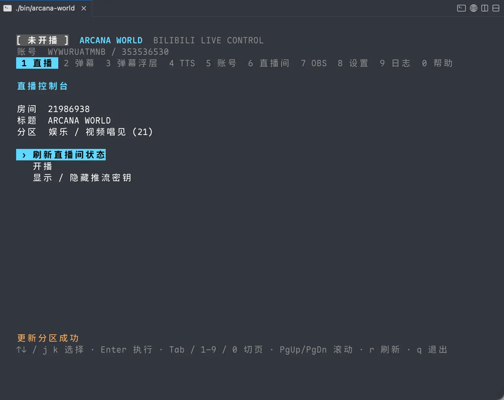
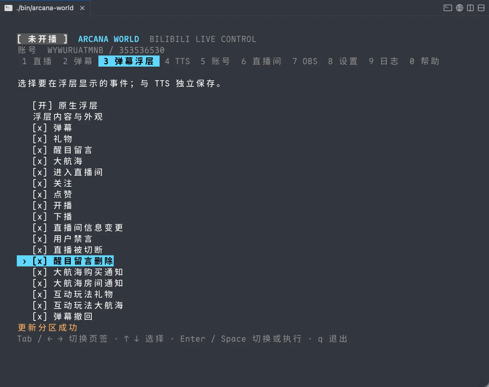
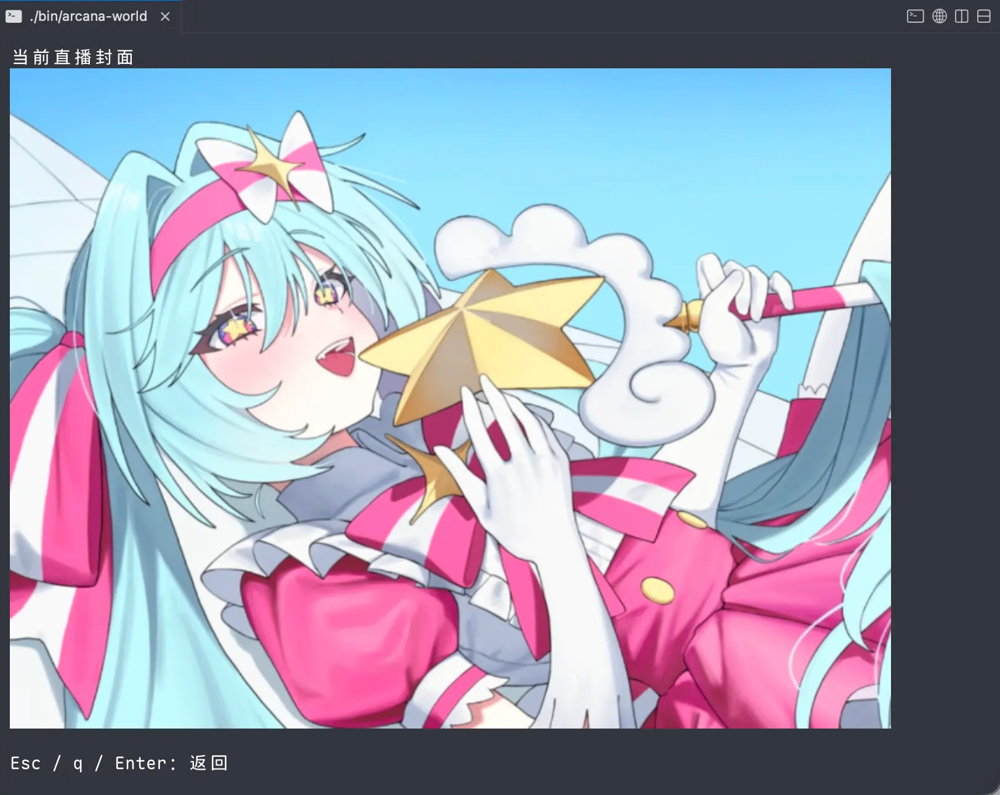
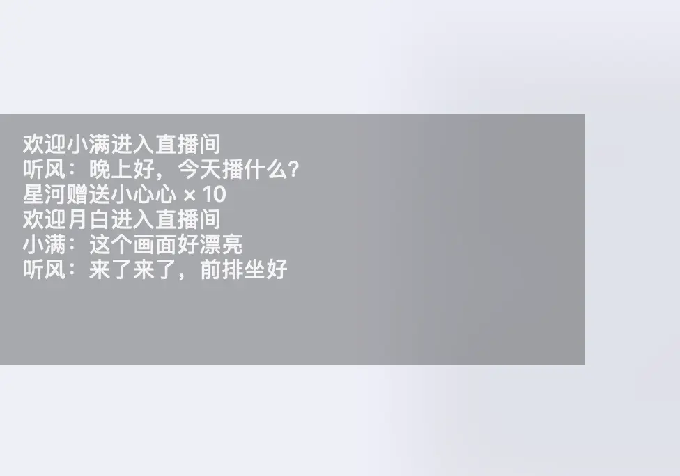
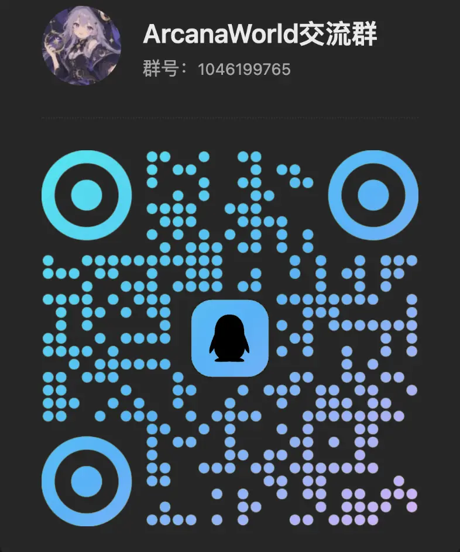

# Arcana World

<p align="center">
  
</p>

[](https://github.com/TarocchiLive/arcana-world/actions/workflows/ci.yml)
[](https://go.dev/)
[](LICENSE)
[](https://github.com/TarocchiLive/arcana-world/releases/latest)
[](https://qm.qq.com/q/TkCteIVlOo)

**中文** · [English](README.en.md)

Arcana World 是一款基于 Go 的 bilibili 直播姬 + 弹幕姬。

支持手机扫码登录，弹幕悬浮窗，语音播报。跨平台。

原生支持Windows、Linux、MacOS。

## 预览

<p align="center">
  
  
  
  
</p>

## 功能亮点

- **扫码登录，连接 OBS，然后一键开播**
- **直播间实时弹幕浏览，提供穿透弹幕悬浮窗，不干扰鼠标键盘操作**
- **支持弹幕，礼物语音播报，SC播报，基于 Edge TTS，0 占用，高质量**
- **常态内存占用 40MB，超轻量、超流畅、超稳定**

## 安装

### 快速开始

从 [最新版本](https://github.com/TarocchiLive/arcana-world/releases/latest) 下载对应平台的包，如 arcana-world-windows-amd64.zip，完整解压后运行根目录的 `arcana-world`（Windows 为 `arcana-world.exe`）即可。

### 从源码构建

从源码构建需要 Go 1.26.8+ 和对应平台的[浮层构建依赖](cmd/arcana-world-overlay/README.md#构建与启动)。Linux 下还需安装 ALSA 开发库与 `pkg-config`，用于构建配套音频程序（Debian/Ubuntu：`libasound2-dev pkg-config`）：

```sh
git clone https://github.com/TarocchiLive/arcana-world.git
cd arcana-world
make desktop
./bin/arcana-world
```

构建后运行 `bin/arcana-world`（Windows 为 `bin/arcana-world.exe`）。只需要终端功能时（无浮层），可使用 `make build`，无需安装图形开发库。浮层的平台支持情况见 [Arcana World Overlay](cmd/arcana-world-overlay/README.md#支持的平台)。

## 开始直播

1. 在「账号」页用哔哩哔哩 App 扫码登录。
2. 在「直播间」页设置标题、分区和封面。
3. 在 OBS Studio 顶栏点击「工具」→「WebSocket 服务器设置」→ 勾选「开启 WebSocket 服务器」→「显示连接信息」→ 复制服务器密码 →「确定」（[官方设置指南](https://obsproject.com/kb/remote-control-guide)）。
   OBS 28 及以上已内置此功能，无需安装插件；旧版请安装与 OBS 版本兼容的 [obs-websocket 5.x 插件](https://github.com/obsproject/obs-websocket/releases)。
4. 在 Arcana World 的「OBS」（`7`）页填写服务器地址（例如 `ws://127.0.0.1:4455`）和刚才复制的密码。
5. 在同一页连接，开启「自动推流」；代理和推流协议在「设置」（`8`）页调整。
6. 回到「直播」页，选择开播。

退出应用默认停止 OBS 推流并关闭当前账号的 B 站直播间，包括从其他客户端开启的直播。可在「设置」（`8`）页分别关闭「退出时停止 OBS 推流」和「退出时关闭直播间」；全部关闭后，退出不执行这两项操作。这些设置不影响直播页的「停播」操作。

切换到不同账号（含扫码登录）或删除当前账号时，会先请求确认，再停止旧账号直播及关联的 OBS 推流；停止失败则不切换或删除。退出设置不影响这些切换清理操作。

如果 B 站要求身份验证，按提示完成后重新开播。

### 弹幕与历史

按 `2` 浏览弹幕与历史；切换页面不会停止监听。

- `s` 开关监听；`Space` 暂停显示 / 跟随最新。
- `[` / `]` 翻页；`End` 回到最新；`o` 切换历史房间。
- `f` 开关白名单内的附加事件；`r` 刷新 / 重试；`PgUp` / `PgDn` 滚动。

默认显示的消息类型见[弹幕显示白名单](docs/danmaku-whitelist.md)。白名单之外的消息即使开启 `f` 也不展示，但原始数据仍保存。

历史按房间保存在数据目录的 `danmaku/history.db`；历史和操作日志保留最近七天并自动清理。断开连接期间的消息不会重新拉取到数据库。

### 桌面浮层

支持无焦点、鼠标穿透的半透明桌面文字浮层。「弹幕浮层」与「TTS」页分别选择要输出的事件，默认勾选所有无需开启 `f` 即可显示的事件；按 `Enter` 或 `Space` 切换。两页配置互不影响，输出模板暂仅支持中文。「TTS」页可选择音色，并提供试听、启停及停止当前播放并清空队列。启用后仅播报新事件，不回放历史；语音合成需要联网。

详见 [Arcana World Overlay](cmd/arcana-world-overlay/README.md)。

### 常用选项

界面默认使用系统语言，也可以手动指定语言或数据目录：

```sh
arcana-world --lang zh-CN               # 使用中文
arcana-world --lang en                  # 使用英文
arcana-world --config-dir /path/to/data # 指定数据目录
arcana-world --help                     # 查看帮助
```

默认数据目录：`~/.arcana/world`。

## TODO
- [x] 支持获取 B 站推流直链，自动连接 OBS 并开播。
- [x] 支持 B 站直播间弹幕抓取，并在 TUI 中浏览礼物和聊天记录。
- [x] 支持 B 站直播间弹幕浮层。
- [x] 支持 TTS 朗读弹幕和礼物播报。
- [x] 多显示器浮层热切换。
- [ ] 鼠标 tui 操作。
- [ ] tui 界面重构美化。
- [ ] 浮层界面重构美化。
- [ ] 支持 iterm2 图片协议。
- [ ] 终端缩放裁剪封面图。

## 开发

```sh
make run    # 本地运行
make check  # 测试与静态检查
make build  # 构建
```

翻译词表位于 [`internal/i18n/locales`](internal/i18n/locales)，按语言和模块划分。欢迎通过 [Issue](https://github.com/TarocchiLive/arcana-world/issues) 或 Pull Request 反馈问题、参与改进。

## 交流与反馈



## 声明

本项目是独立开发的开源工具。使用者应自行遵守适用的法律法规和平台规则。本项目仅用于学习和交流 Go 及相关框架，请勿用于其他用途。


## 许可证

采用 [GPL-3.0-only](LICENSE)。

## 致谢

- 社区内无私提供相关平台 API 声明与实现参考的各位大佬。
- [Radekyspec/StartLive](https://github.com/Radekyspec/StartLive)：本项目推流协议实现的来源。
- [Bubble Tea](https://github.com/charmbracelet/bubbletea)：终端界面框架。
